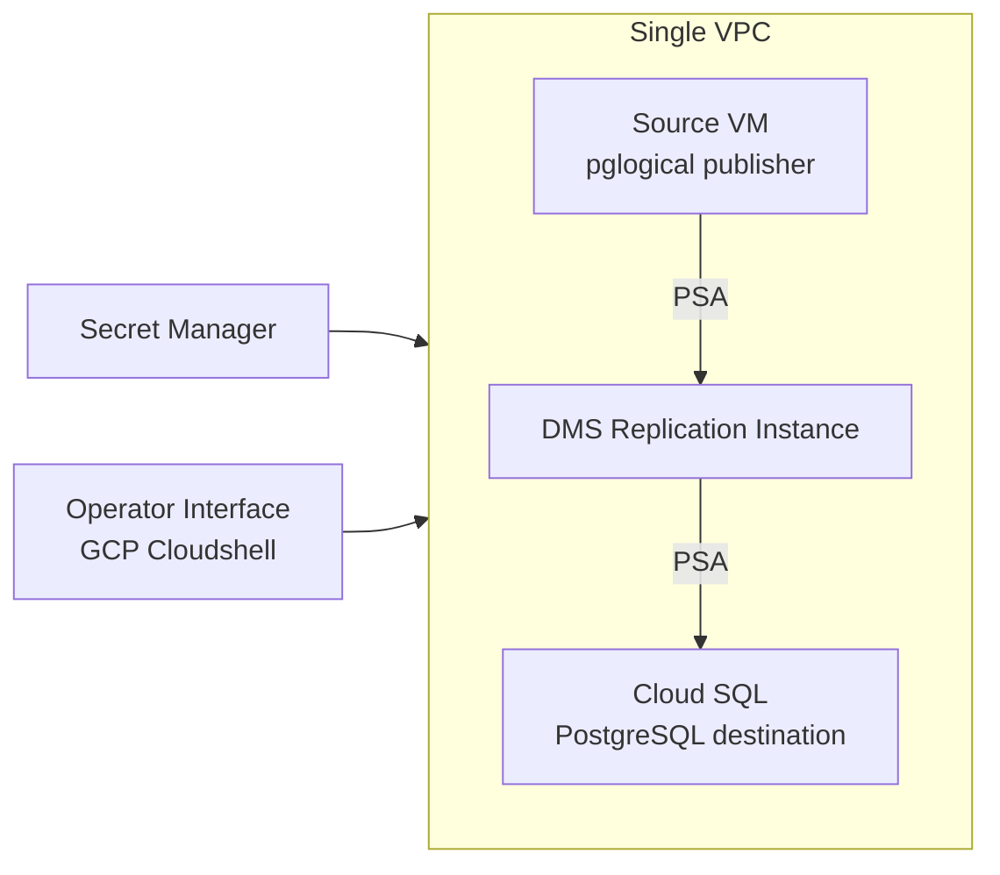

# ON-PREM TO CLOUD DATABASE MIGRATION

## Introduction
This project replicates continuos database (DB) migration comprising change data capture (CDC) simulated entirely in GCP.
<!-- [Full Architectural Overview](../diagrams/architecture-overview.png) -->
## Architecture Overview
The architecture uses a single virtual private cloud(VPC) which contains the source and destination databases. This choice is documented [here](./docs/decisions/ADR-001-vpc-and-vpn-network-design.md)
The archiecture overview diagram is as follows:

[Network Topology](../diagrams/network-topology.png)
[Migration Flow](../diagrams/migration-flow.png)

## Scope 
This project implements the onprem to cloud migration using GCP services. It covers a single VPC architecture documented in this folder and the [2 VPC architecture](../03-onprem-to-cloud-data-migration/README.md)

## Results
The video demos of the results showing the replication until change data capture, promotion, cutoff and validation are as follows:
### Demo
[Full Implementation Until CDC](https://www.loom.com/share/806b175b55764ebea9e51bb93447789c)
[CDC to promotion and cutoff + Validation](https://www.loom.com/share/7471ae18ceb14cc2b39a9b15b8da1092)

