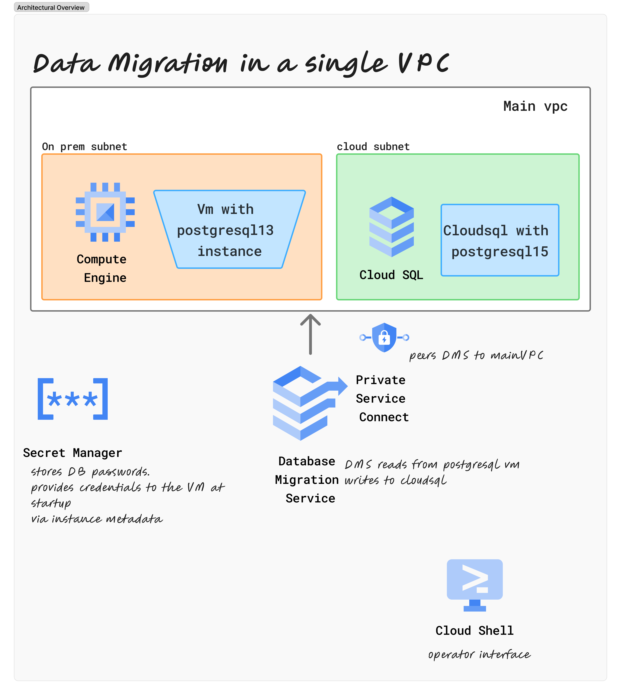

# On-Premises to Cloud Data Migration — Single VPC Architecture

## Project Overview

This project demonstrates a continuous database migration from a simulated on-premises
PostgreSQL database to Google Cloud SQL PostgreSQL 15 using Google Cloud Database
Migration Service (DMS) with Change Data Capture (CDC).

The architecture uses a single GCP VPC to simulate the network topology of a real
production migration where an on-premises database is connected to a single cloud
VPC via Dedicated Interconnect or Cloud VPN.

---

## Architecture



---

## Key Architectural Decisions
Brief summary of the main decisions made, linking to ADRs.
- [ADR-001](./docs/decisions/ADR-001-vpc-and-vpn-network-design.md) — single vpc 
- [ADR-002](./docs/decisions/ADR-002-DMS-vs-alternatives.md) — DMS
- [ADR-003](./docs/decisions/ADR-003-cloudsql-vs-alloydb.md) — cloudSQL v AlloyDB
- [ADR-004](./docs/decisions/ADR-004-pglogical-for-CDC.md) — pglogical for CDC
- [ADR-005](./docs/decisions/ADR-005-Terraform-for-IaC.md) — IaC via Terraform

## Network Design

| Component | CIDR | Purpose |
|---|---|---|
| `source-subnet` | `10.0.1.0/24` | PostgreSQL VM subnet |
| `target-subnet` | `10.0.2.0/24` | Defined but unused — Cloud SQL uses Private Service Access |
| Private Service Access | `10.80.0.0/16` | GCP-managed range — Cloud SQL and DMS use this |
| IAP range | `35.235.240.0/20` | Secure SSH and TCP access from Cloud Shell |

### Key Networking Insight

Cloud SQL does not use user-defined subnets. Its private IP (`10.80.0.3`) is
allocated from the **Private Service Access** range — a GCP-managed peering
range attached to the VPC. This same range is also where DMS originates its
connection traffic when reaching the source database.

---

## Components

| Component | Technology | Purpose |
|---|---|---|
| Source database | PostgreSQL 13 on Compute Engine `e2-medium` | Simulates on-premises database |
| Destination database | Cloud SQL PostgreSQL 15 (`db-custom-2-4096`) | Cloud target |
| Migration service | GCP Database Migration Service | CDC continuous replication |
| Replication | pglogical 2.3.3 | Logical replication extension required by DMS |
| Secrets | Secret Manager | Database password storage |
| IaC | Terraform | All infrastructure provisioned as code |

---

## Dataset

A synthetic retail database was generated using Faker:

| Table | Rows |
|---|---|
| customers | 10,000 |
| products | 5,000 |
| orders | 50,000 |
| order_items | 225,975 |
| **Total** | **290,975** |

---

## Migration Flow

```
Phase 1 — FULL_DUMP
PostgreSQL → DMS reads all tables → bulk loads into Cloud SQL

Phase 2 — CDC
pglogical creates replication slots on PostgreSQL
DMS subscribes to WAL stream → applies changes to Cloud SQL in real time

Phase 3 — PROMOTE
Replication stops → Cloud SQL becomes standalone primary
```

---

## Key Discovery — DMS Connectivity

The most significant finding of this project relates to how DMS connects to the
source database. GCP documentation describes using a DMS private connection
(VPC peering) for private connectivity. However the actual behaviour is:

**DMS connects from the Private Service Access range — not from the DMS private
connection subnet.**

In this project DMS connected from `10.80.0.2` — an IP within the Private Service
Access range `10.80.0.0/16`. This means:

1. The firewall rule for PostgreSQL port 5432 must allow the Private Service Access CIDR
2. `pg_hba.conf` must allow the Private Service Access CIDR
3. The DMS private connection subnet (`10.0.3.0/29`) is never actually used

The Private Service Access range is dynamically allocated by GCP and varies per
project. It must be retrieved after provisioning:

```bash
gcloud compute addresses describe private-service-access \
  --global \
  --project=$PROJECT_ID \
  --format="value(address,prefixLength)"
```

---

## pglogical Requirement

DMS CDC requires the `pglogical` extension on the source PostgreSQL instance.
This was not documented prominently in the DMS setup guides. The following
configuration is required:

```bash
# Install
sudo apt-get install -y postgresql-13-pglogical

# Add to postgresql.conf
shared_preload_libraries = 'pglogical'

# Restart PostgreSQL then create extension
sudo -u postgres psql -c "CREATE EXTENSION pglogical;"
sudo -u postgres psql -d retail_db -c "CREATE EXTENSION pglogical;"

# Grant privileges to migration user
sudo -u postgres psql -c "GRANT USAGE ON SCHEMA pglogical TO migration_user;"
sudo -u postgres psql -c "GRANT ALL ON ALL TABLES IN SCHEMA pglogical TO migration_user;"
sudo -u postgres psql -d retail_db -c "GRANT USAGE ON SCHEMA pglogical TO migration_user;"
sudo -u postgres psql -d retail_db -c "GRANT ALL ON ALL TABLES IN SCHEMA pglogical TO migration_user;"
```

---

## Validation Results

All validation checks passed after migration completion:

```
── Row Count Reconciliation ──────────────────────────
╭─────────────┬──────────┬──────────┬──────────╮
│ Table       │ Source   │ Target   │ Result   │
├─────────────┼──────────┼──────────┼──────────┤
│ customers   │ 10,000   │ 10,000   │ ✅ PASS  │
│ products    │ 5,000    │ 5,000    │ ✅ PASS  │
│ orders      │ 50,000   │ 50,000   │ ✅ PASS  │
│ order_items │ 225,975  │ 225,975  │ ✅ PASS  │
╰─────────────┴──────────┴──────────┴──────────╯

── Order Total Checksum ──────────────────────────────
Grand Total: $339,536,264.49 — Source matches Target ✅

── Summary ───────────────────────────────────────────
Row Counts            ✅ PASS
Referential Integrity ✅ PASS
Order Totals          ✅ PASS
Spot Sample           ✅ PASS

✅ ALL CHECKS PASSED
```

---

## Infrastructure as Code

All infrastructure is provisioned using Terraform:

| File | Purpose |
|---|---|
| `main.tf` | APIs, backend, providers |
| `networking.tf` | VPC, subnets, firewall rules, Private Service Access |
| `compute.tf` | PostgreSQL VM, startup script |
| `iam.tf` | Service accounts, IAM bindings |
| `secrets.tf` | Secret Manager for database password |
| `dms.tf` | DMS connection profiles |
| `variables.tf` | Input variables |
| `outputs.tf` | Key resource outputs |
| `scripts/startup.sh` | PostgreSQL installation and configuration |

---

## Equivalent Services on AWS and Azure

| GCP | AWS | Azure |
|---|---|---|
| Database Migration Service | AWS Database Migration Service | Azure Database Migration Service |
| Cloud SQL PostgreSQL | Amazon RDS PostgreSQL | Azure Database for PostgreSQL |
| Cloud VPN | AWS Site-to-Site VPN | Azure VPN Gateway |
| Private Service Access | AWS PrivateLink | Azure Private Link |
| Secret Manager | AWS Secrets Manager | Azure Key Vault |
| VPC | VPC | Virtual Network |
| IAP | AWS Systems Manager Session Manager | Azure Bastion |

---

## Lessons Learned

| # | Lesson |
|---|---|
| 1 | DMS connects from Private Service Access range — not DMS private connection subnet |
| 2 | pglogical extension is mandatory for CDC — install before starting migration |
| 3 | Cloud SQL private IP comes from Private Service Access range — not user-defined subnets |
| 4 | DMS source connection profile defaults to DESTINATION role — always specify `--role=SOURCE` |
| 5 | migration_user must be created manually on Cloud SQL after DMS migration |
| 6 | Cloud Shell cannot reach internal VPC IPs — use IAP TCP tunnel for validation |
| 7 | Private Service Access range is dynamically allocated — retrieve after provisioning |
| 8 | `google_database_migration_service_migration_job` not in stable Terraform provider |
| 9 | Destination connection profile is lost when migration job is deleted |
| 10 | Use `restart` not `delete/create` when retrying failed migration jobs |

---

## Estimated Cost

| Resource | Duration | Estimated Cost |
|---|---|---|
| Compute Engine VM (e2-medium) | 8 hours | ~€0.10 |
| Cloud SQL (db-custom-2-4096) | 8 hours | ~€0.80 |
| Cloud Storage (state bucket) | — | ~€0.01 |
| DMS (under 50GB) | — | Free |
| **Total** | | **~€1.00** |

---

## Related Projects

- [02-onprem-to-cloud-data-migration](../02-onprem-to-cloud-data-migration) —
  Two-VPC architecture with Classic VPN simulating a more complex network topology.
  Documents the troubleshooting journey and architectural trade-offs of using DMS
  with a VPN-separated source and destination.
