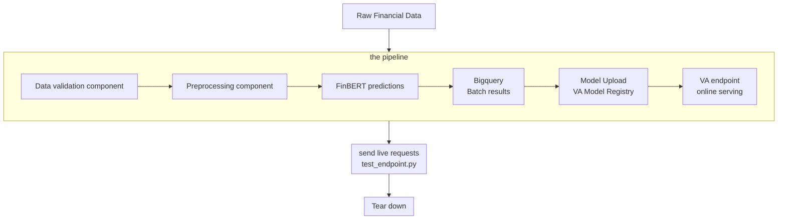

# INFERENCE PIPELINE FOR FINANCIAL SENTIMENTS ANALYSIS

## Introduction
This project is the first  of a 2 part (so far) iteration of the MLOps inference pipeline.
This pipeline is for a financial sentiments analysis model which uses FinBERT and the financial phrasebank data. [The second part](../05-inference-pipeline-w-eleventts/README.md) integrates a text to speech API to the tail end of the pipeline during inference calls 

## Architecture
This pipeline contains the model serving components and functionalities of the financial sentiments analysis model.
### Architecture Diagram

The full details of the architecture is documented and the results are also available [here](./docs/ADD.md) 

