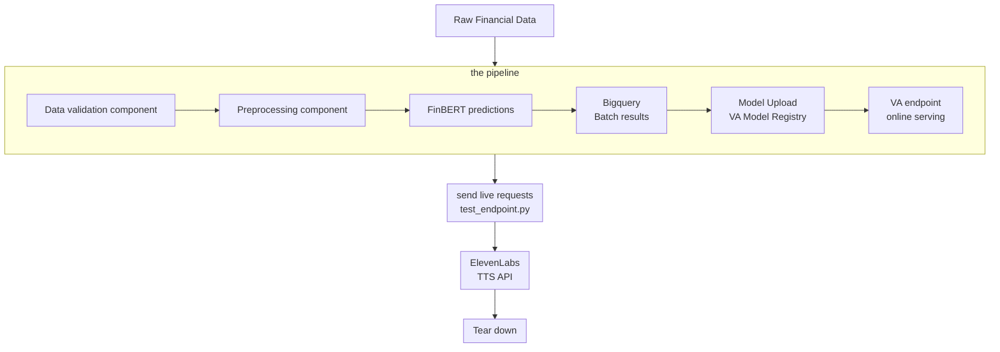

# FINANCIAL SENTIMENTS ANALYSIS INFERENCE PIPELINE WITH ELEVENLABS TEXT TO SPEECH (TTS) API

## Introduction
This continues from financial sentiments analysis pipeline and integrates a text to speech API (elevenlabsTTS) on top of the serving request response to generate audio files of the inference results. The overall architecture is as follows
## Architecture Overview

