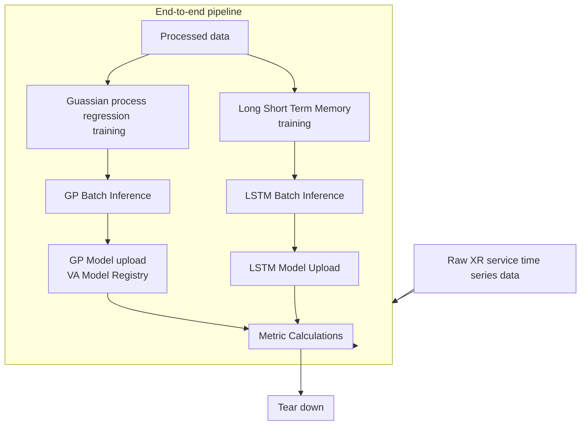

# Long Short Term Memory (LSTM) and Gaussain Process (GP) Extended Reality(XR) User Equipment(UE) Energy Efficiency(EE)

## Introduction
This is the replication of a project I designed and implemented during my PhD in distributed systems and applied machine learning.
### Cellular Network Overview
Cellular networks user devices use discontunous reception (DRX) stipulated by the technology standards to manage the energy consumption on mobile devices. This mechanism has potential limtations with new age services such as the services under 6G. 
#### EE for XR
#### ML-driven EE
For this project ML-DRX which uses machine learning algorithms to optimise the DRX EE improvement mechanism is implemented. Two machine learning algorithms are utilised and the architecture diagram is here shown:

### Architectural Overview
The overview of the end to end pipeline of the XR EE system(ML-side) is as follows:

<!-- ## Scope
### Sections and Components
#### Monitoring
## Results -->

<!-- # Overview

This project covers the end to end ML pipeline in the cloud from data ingestion to model monitoring using two machine learning models long short term memory (LSTM) and gaussian process (GP) for energy eficiency improvement on cellular networks UEs targeting XR services.

The [architectural decisions](../06-phd-to-gcp-xr-ml-drx/docs/ADD.md) and the [full execution walkthrough](WALKTHROUGH.md) are in their respective files. -->

