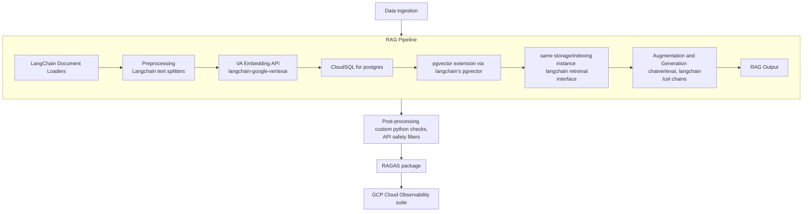

# Retreival Augmented Generation (RAG) Pipeline

## Introduction
This project details the end-to-end RAG pipeline on GCP for document Q&A. LangChain, Vertex AI embeddings/generation, pgvector on cloudSQL as well as IaC through terraform. Multi-resource retreival and grounded refusal on insufficient context

## Architecture Overview
### Architecture Diagram

The full architecture design and decisions are detailed [here](./docs/ADD.md)

## Scope
## Results

